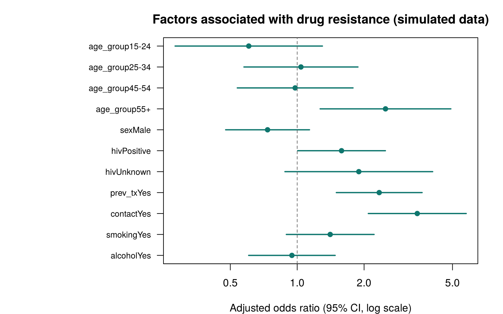

# TB Drug-Resistance Risk Factors — reproducible R workflow

A clean, reproducible version of the analysis workflow behind my peer-reviewed paper:

> **Okumu A, et al.** Factors associated with tuberculosis drug resistance among presumptive MDR-TB patients identified in a DR-TB surveillance study in western Kenya. *J Clin Tuberc Other Mycobact Dis.* 2024;37:100466.

> ⚠️ **Data note:** all data here are **simulated** by `R/01_simulate_data.R`, using assumed illustrative effects. They **do not** reproduce the study's patient data or its findings. The repo shows the *method* (cleaning, descriptive epidemiology, logistic regression) and keeps patient data confidential.

## Pipeline

| Step | Script | Output |
|---|---|---|
| 1. Simulate | `R/01_simulate_data.R` | 650 presumptive MDR-TB patients across 5 western Kenya counties, with planted data-quality issues |
| 2. Clean | `R/02_clean.R` | Deduplication, plausibility checks, recoding, age bands, reference levels; every change goes to `outputs/cleaning_log.txt` |
| 3. Analyse | `R/03_analysis.R` | Table 1 by resistance status (χ²), crude and adjusted odds ratios, forest plot |

```
Removed 3 duplicate patient records
Set 2 implausible ages to missing
Harmonised 4 non-standard sex codes (1 left missing)
Complete cases: 641 of 650 | resistant: 118 (18.4%)
```



## Run it

Base R only, no packages needed:

```bash
Rscript run_all.R
```

## Methods highlighted

- Complete-case analysis with transparent reporting of missingness
- Univariable screening and a multivariable logistic model with Wald 95% CIs
- Audit-trail cleaning, matching the data-governance practice I used as Data Manager on multi-country studies (Reach Wiser, University of Oxford)

**Stack:** R (base, stats, graphics) · also experienced with Stata, SAS, SPSS, REDCap, ODK
